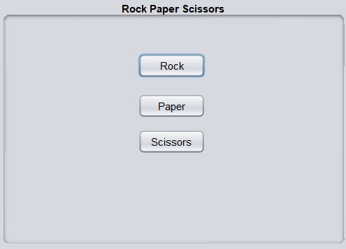
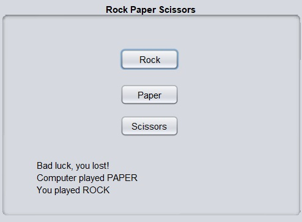
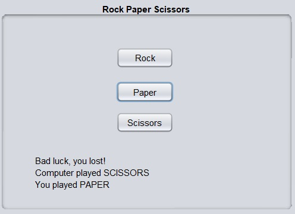
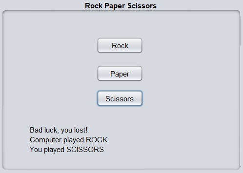

# Project Title
Rock, Paper, Scissors game
## Description
This application, developed using Java Swing, allows users to play Rock, Paper, or Scissors against the CPU, which randomly generates its choice and displays the game's outcome on the screen.

## Java version
- The project is using Java Development Kit (JDK) version 16

### Installing and Running
- Simply download the RockPaperScissorsGame.jar file and run it

## Contact
- Full name: Manuele Tacchetti
- Email: manuele.tacchetti@gmail.com

# Screenshots

- Home Screen

- Choice: Rock

- Choice: Paper

- Choice: Scissors

